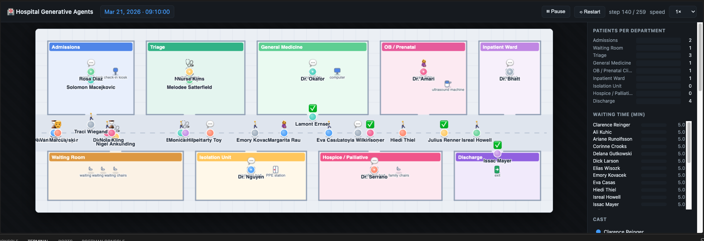

# Hospital Generative Agents

A faithful port of Stanford's **Generative Agents** (Smallville, arXiv 2304.03442)
to a **hospital**. Villagers become **patients and clinical staff**; Smallville
becomes a **General Hospital**. The 25 synthetic FHIR encounters in
[`dataset/`](dataset) are the *knowledge the agents have about the hospital*:
they seed the world's departments, each patient's own chart and symptoms, and the
staff's aggregated clinical knowledge.



> Inspired by [joonspk-research/generative_agents](https://github.com/joonspk-research/generative_agents).

The original cognitive architecture is kept intact — the same
`perceive → retrieve → plan → reflect → execute` chain, the same three memory
structures, the same `world:sector:arena:game_object` maze addressing, and the
same `movement` / `meta` replay contract. Only the domain content and the LLM
backend (Claude, not OpenAI) change.

> The full design rationale lives in [`hospital_gen_agent/CLAUDE.md`](hospital_gen_agent/CLAUDE.md)
> and the detailed specs in [`hospital_gen_agent/plans/`](hospital_gen_agent/plans).

---

## Why this exists

**The problem.** You can't experiment on a real hospital. You can't rerun a bad
night in the ER to see whether a second doctor would have cleared the backlog, and
you can't test a new triage policy on live patients. The knowledge needed to answer
those questions is scattered across charts, transcripts, and staff who go home at
the end of a shift — real operational data is siloed, sensitive, and impossible to
replay. So the questions that matter most for patient flow go unanswered, and the
lessons only arrive after someone has already paid for them.

**What this builds.** A living, synthetic hospital you *can* experiment on. Every
patient and clinician is a generative agent with the full Stanford cognitive
architecture — they perceive their surroundings, retrieve memories, plan, hold
conversations, and reflect. The agents are seeded entirely from
[synthetic FHIR data](dataset) (no real patient, nothing at stake), so each patient
carries their own chart and story and each clinician carries department-level
clinical knowledge aggregated from the dataset. Run the whole hospital forward and
watch care actually flow room to room.

That opens up two things at once:

- **A human story** — follow one patient (Clarence Reinger's prenatal visit) from
  check-in through triage to a real, grounded OB consult, so you can see the
  cognition produce believable, clinically faithful behavior at the individual
  level.
- **An operations story** — turn the same world into a what-if lab: the live
  replay already tracks per-department occupancy and per-patient waiting time, and
  the design's second act (specced in
  [`plans/SUBPLAN_D`](hospital_gen_agent/plans/SUBPLAN_D_scenario_comparison.md))
  extends this to a mass-casualty surge run with one ER doctor versus three, so the
  wait-time and bottleneck charts show exactly where the system breaks — before it
  breaks on real people.

The bet: the most useful thing to build in healthcare isn't a system that acts on
patients, it's one that lets you learn the hard operational lessons safely, in
simulation, first.

---

## What it does

`run_slice.py` runs the whole bake end to end and leaves a self-contained replay
in `web/`:

```
seed → maze → direct → compress → replay
```

1. **Seed** — turn the 25 dataset records into persona bootstrap files: one
   patient per record (routed to their real department by `visit_type`), plus
   authored staff (one doctor per department, two triage nurses, a reception
   clerk) whose memory is aggregated from the dataset.
2. **Maze** — generate the logical hospital grid (matrices + `web/world.json`)
   from the grid spec.
3. **Direct** — step every persona through the hospital via the live cognition
   loop, writing one movement frame per step. The hero's OB consult
   (Clarence Reinger) replays the **verbatim** clinician transcript.
4. **Compress** — fold the per-step frames into a delta-encoded
   `web/master_movement.json`.
5. **Replay** — a dependency-free canvas renderer (`web/hospital.html`) animates
   the bundle.

The whole pipeline runs **offline with no API key** in canned LLM mode.

---

## Quick start

From the repo root, using the project virtualenv:

```bash
cd hospital_gen_agent

# 1. Bake the replay (no API key needed — canned LLM mode is the default).
HGEN_LLM_MODE=canned ../.venv/bin/python run_slice.py

# 2. Serve the web dir and open the replayer.
../.venv/bin/python -m http.server 8000 --directory web
# open http://localhost:8000/hospital.html
```

Dependencies (`requirements.txt`): `anthropic`, `numpy`. `anthropic` is only
imported for live API calls, so canned-mode bakes need neither the SDK nor a key.

---

## Modes

Two environment variables control the run.

### `HGEN_MODE` — director

| Value | Behavior |
|-------|----------|
| `autonomous` *(default)* | Full hospital: all 25 patients, each routed to their real department, arriving staggered and walking their care pathway via the live cognition loop. Clarence's verbatim OB consult is kept. |
| `scripted` | Legacy hand-timed OB vertical slice (7-persona cast). A fallback. |

### `HGEN_LLM_MODE` — Claude backend

| Value | Behavior |
|-------|----------|
| `canned` *(default)* | Never touches the network; returns deterministic per-prompt stubs. Runs the entire pipeline offline. |
| `cache` | Serve cached completions on hit; call the live API on a miss and store the result (`hgen/.llm_cache/`). |
| `live` | Always call the live Anthropic API and refresh the cache. Requires `ANTHROPIC_API_KEY`. |

Model tiers (`hgen/config.py`): `claude-sonnet-5` for the frequent, cheap
cognition calls; `claude-opus-4-8` for the low-frequency reflection.

---

## Layout

```
hospital_gen_agent/
├── run_slice.py           top-level orchestrator: seed → maze → direct → compress
├── CLAUDE.md              the full port plan
├── plans/                 detailed subplan specs (seeding, slice, frontend, ER surge)
├── hgen/                  the package
│   ├── config.py          absolute paths, model ids, world constants
│   ├── contracts.py       shared schemas + JSON IO (ConceptNode, Scratch, meta/movement)
│   ├── compress.py        per-step movement → delta-encoded master_movement.json
│   ├── llm/
│   │   ├── claude_backend.py   the single Anthropic seam (llm(); canned/cache/live)
│   │   └── prompts.py          cognition prompt helpers (analog of run_gpt_prompt_*)
│   ├── seeding/           dataset → bootstrap files
│   │   ├── build.py            seeding CLI: build every persona + meta + environment
│   │   ├── world.py            visit_type → department map; canonical world tree
│   │   ├── patients.py         one record → Scratch + associative + spatial memory
│   │   ├── staff.py            authored staff + dataset-aggregated clinical knowledge
│   │   ├── notes.py            transcript / clinical-note / AVS parsing
│   │   └── names.py            FHIR name normalization
│   ├── cognition/         the ported agent brain
│   │   ├── persona.py          identity + 3 memory structures + move() chain
│   │   ├── modules.py          perceive/retrieve/plan/reflect/execute
│   │   ├── memory.py           AssociativeMemory (memory stream) + MemoryTree (spatial)
│   │   ├── autonomous.py       autonomous director: full-hospital bake
│   │   └── director.py         scripted director: legacy OB vertical slice
│   └── world/             the maze
│       ├── grid.py             hospital grid spec → matrices + world.json
│       ├── maze.py             loads matrices into an addressable tile grid
│       ├── path_finder.py      4-connected BFS pathfinding
│       └── build_maze.py       CLI to write maze assets + self-test
├── web/                   the replayer (see web/README.md)
│   ├── hospital.html           single-file vanilla-JS canvas renderer
│   ├── world.json              rooms + objects floor plan
│   ├── meta.json               sim clock + persona names
│   └── master_movement.json    baked, delta-compressed movement (generated)
└── storage/               generated bootstrap + per-step frames (gitignored)
    └── base_hospital/
        ├── personas/<Name>/bootstrap_memory/   scratch + spatial + associative
        ├── environment/0.json                  initial spawn tiles
        ├── movement/<step>.json                per-step director output
        └── reverie/meta.json
```

---

## The cognitive loop

Each persona runs the original chain unchanged; only the domain content differs
(see `hgen/cognition/modules.py`):

```
perceive ─→ retrieve ─→ plan ─→ reflect ─→ execute
   │           │           │        │          │
 nearby     keyword +   care     convo →    BFS path,
 tiles &    relevance   pathway  thoughts   returns
 agents     recall of   routing  & insights (next_tile,
 → memory   memories    (LLM)    (LLM)      emoji, desc)
```

**Three memory structures per agent** (mirroring Stanford):
- **`scratch`** — identity (name, age, `innate`/`learned`/`currently`/`lifestyle`)
  plus the current action and chat state.
- **associative memory** — the memory stream of `ConceptNode`s (event / thought /
  chat), newest-first and keyword-indexed, with the original retrieval scoring
  (`recency*0.5 + relevance*3 + importance*2`). Relevance falls back to keyword
  overlap when embeddings are empty (the default), so no embedding model is
  required.
- **spatial memory** — a `world → sector → arena → [game_objects]` tree, grown as
  the agent perceives new tiles.

Planning follows a deterministic hospital **care pathway** (arrive → reception →
wait → triage → department → consult → receive plan → discharge → exit) in place
of the original hourly schedule, while action-location resolution, reactions,
`pronunciatio` emoji, event triples, and reflection all still route through the
LLM.

---

## The verbatim consult

The dataset ships the real clinician–patient `transcript` and `note` for each
encounter. For the hero (Clarence Reinger's prenatal visit), when he reaches the
OB exam table co-located with Dr. Amari, the real `DR:` / `PT:` / `FAMILY:` lines
are injected directly as `chat`, paced across steps. This is the highest-stakes
scene, so it is fixed to the real transcript — it cannot drift or stall, and
needs no model call. Everything *around* the consult (triage, reactions, routing,
and the post-consult reflection where Clarence internalizes the diagnosis) still
runs through the cognition loop.

---

## Notes

- `storage/`, `.env`, and `hgen/.llm_cache/` are gitignored.
- Individual stages can be run on their own:
  `python -m hgen.seeding.build`, `python -m hgen.world.build_maze`, and
  `python -m hgen.compress`.
- The renderer's inputs and controls are documented in
  [`hospital_gen_agent/web/README.md`](hospital_gen_agent/web/README.md).
